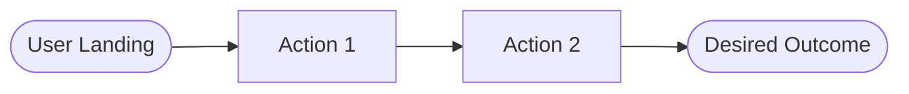

# Product Requirements Document (PRD)

## 1. Product Overview & User Personas
- **Product Name:** 
- **Product Description:** High-level summary of what the product does from a user's perspective.
- **Key User Personas:**
  - **Persona A (e.g. Primary User):** Needs, pain points, core actions.
  - **Persona B (e.g. Admin / Operator):** Governance, management, observation needs.

## 2. User Journey & Core User Flows

## 3. Functional Requirements (User Stories & Features)
### Feature Group 1: [Feature Area Name]
1. **US-01 [Feature Title]:**
   - **Story:** As a `<user>`, I want to `<action>`, so that `<value>`.
   - **Acceptance Criteria (Gherkin format):**
     - *Given* `<initial state>`
     - *When* `<user performs action>`
     - *Then* `<expected outcome>`
   - **Edge Cases & Error States:** Empty data, network timeout, invalid input handling.

## 4. Non-Functional Requirements (NFRs) & Quality SLOs
- **Performance:** Page load time, API response latency, token streaming speed.
- **Security & Privacy:** Authentication, authorization (RBAC), data encryption.
- **Accessibility (a11y):** Keyboard navigation, screen-reader support, contrast ratio.
- **Reliability & AI Guardrails:** Fallbacks on model failure, rate-limit resilience.

## 5. Scope & Boundary Management
- **In-Scope (MVP / Milestone 1):** Mandatory features for current delivery.
- **Out-of-Scope (Strictly Excluded):** Ideas deferred to later iterations to prevent scope creep.
