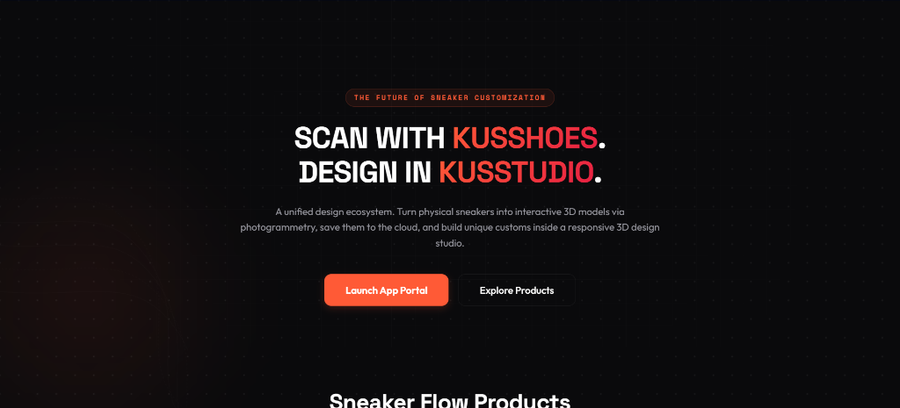

# 👟 KusShoes & KusStudio: 3D Sneaker Customization Ecosystem

KusShoes is a state-of-the-art 3D sneaker customization web application built using **React**, **Vite**, **TypeScript**, and **Framer Motion**. The system enables designers and streetwear enthusiasts to digitize physical footwear via photogrammetry (using mobile-based scanning APIs) and refine/edit 3D assets in a desktop-compatible digital workspace (KusStudio).

---

## 📸 Giao diện Landing Page (Mockup)



---

## ✨ Các Phân Hệ & Tính Năng Nổi Bật

1. **KusShoes Mobile (Scanner Companion)**:
   - Tích hợp mô phỏng luồng quét ảnh 360° trực quan trên điện thoại.
   - Hỗ trợ kết nối Cloud Vault lưu trữ mesh, vertex normal và texture của giày.
2. **KusStudio Desktop (Workspace Client)**:
   - Trình chỉnh sửa WebGL tăng tốc phần cứng mượt mà.
   - Bảng log terminal `kusstudio_daemon.log` thời gian thực kết nối cổng local daemon `8421`.
3. **Danh sách Projects (Project Directory)**:
   - Bộ lọc danh sách (Grid/List View) đi kèm bộ thanh công cụ thao tác hàng loạt.
   - Hiệu ứng Hover Zoom 1.08x thông minh và cơ chế đàn hồi đẩy card lân cận (Sibling Pushing).
   - Hiển thị HUD chi tiết (Thiết bị quét, Số lượng ảnh gốc, Vertices...).
4. **Hệ thống Quản lý Dự án & Chia sẻ (Project Details & Sharing)**:
   - Giao diện banner HUD kỹ thuật, terminal kết nối KusStudio và tải xuống 4 định dạng (.gltf, .obj, .fbx, .usdz).
   - Phân quyền chia sẻ dự án (Edit/View) nội bộ và kiểm soát Visibility.
5. **Đa dạng giao diện màu sắc (Theme Preferences)**:
   - Chế độ **Light Mode** tông màu kem/giấy ấm và **Dark Mode** bóng đen nhám chất lượng cao.
   - Script IIFE chặn đứng hoàn toàn hiện tượng chớp nháy màu nền (Theme Flash) khi reload.

---

## 🛠️ Công Nghệ Sử Dụng

- **Core**: React 19 + TypeScript + Vite 8
- **Styling**: CSS Modules (`[Component].module.css`) + CSS Custom Variables
- **Animations**: Framer Motion + CSS Keyframes
- **Icons**: Lucide React
- **3D Preview Engine**: WebGL Canvas

---

## 🚀 Hướng Dẫn Chạy Cục Bộ (Local Setup)

### 1. Cài đặt các thư viện phụ thuộc
```bash
npm install
```

### 2. Khởi chạy máy chủ phát triển
```bash
npm run dev
```

### 3. Đóng gói mã nguồn (Build)
```bash
npm run build
```
Mã nguồn đóng gói sẽ được xuất ra thư mục `dist/` sẵn sàng triển khai lên Production.

---

## 📂 Cấu Trúc Thư Mục Chính
- `src/components/`: Các UI components tái sử dụng (Navbar, Footer, Sidebar, InteractiveParticleGrid...).
- `src/pages/`: Các trang chính tương ứng với các route (Landing, Products, Dashboard, Projects, Settings...).
- `src/styles/`: Tệp tin biến môi trường màu sắc và phông chữ (`variables.css`).
- `src/context/`: Context quản lý trạng thái theme Light/Dark (`ThemeContext.tsx`).
- `public/`: Chứa các tài nguyên tĩnh, favicon, logo và hình minh họa.
