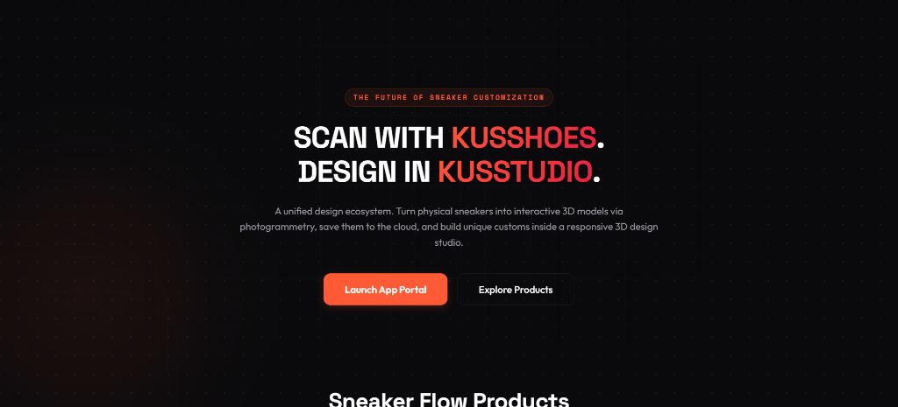

# 👟 KusShoes & KusStudio: 3D Sneaker Digitization & Customization Platform

[](https://kusshoes.kietta.me)
[](LICENSE)

> **Trang chủ chính thức / Official Website:** [https://kusshoes.kietta.me](https://kusshoes.kietta.me)

**KusShoes** là hệ sinh thái số hóa và cá nhân hóa giày sneaker 3D đột phá, kết hợp giữa ứng dụng di động quét ảnh photogrammetry và studio thiết kế 3D chuyên nghiệp **KusStudio**. Người dùng có thể quét bất kỳ đôi giày thật nào bằng điện thoại, dựng mô hình 3D trên đám mây và tùy biến màu sắc, hoa văn, chất liệu trực quan trong không gian 3D.

---

## 🌐 Các Trang Chính Thức (Official Links)

- **Trang chủ (Home):** [https://kusshoes.kietta.me](https://kusshoes.kietta.me)
- **Sản phẩm & Ứng dụng (Products):** [https://kusshoes.kietta.me/products](https://kusshoes.kietta.me/products)
- **Bảng giá & Gói dịch vụ (Pricing):** [https://kusshoes.kietta.me/pricing](https://kusshoes.kietta.me/pricing)
- **Chính sách bảo mật (Privacy Policy):** [https://kusshoes.kietta.me/privacy](https://kusshoes.kietta.me/privacy)
- **Điều khoản dịch vụ (Terms of Service):** [https://kusshoes.kietta.me/terms](https://kusshoes.kietta.me/terms)

---

## 📸 Giao Diện Nền Tảng



---

## 🌟 Điểm Nổi Bật Của Hệ Sinh Thái KusShoes

1. **KusShoes Mobile (Scanner Companion)**:
   - Hướng dẫn góc chụp 360° trực quan trên camera điện thoại.
   - Kết nối Cloud Photogrammetry (KIRI Engine) tự động tính toán mesh, vertex normal và texture chất lượng cao.
2. **KusStudio Desktop (Workspace Client)**:
   - Trình render 3D WebGL tăng tốc phần cứng mượt mà.
   - Thử nghiệm chất liệu da, vải canvas, cao su, kim loại và gắn sticker logo tùy biến.
   - Xuất file 3D tiêu chuẩn: `.gltf`, `.obj`, `.fbx`, `.usdz` tương thích Blender, Unreal Engine, Unity và AR.
3. **Quản Lý Dự Án & Đồng Bộ Đám Mây**:
   - Kho lưu trữ Cloud Vault an toàn, hỗ trợ quản trị phiên bản và chia sẻ liên kết xem 3D trực tiếp (Artisan Viewer).

---

## 🛠️ Công Nghệ Phát Triển

- **Frontend Web**: React 19, TypeScript, Vite, CSS Modules, Framer Motion, GSAP ScrollTrigger, Three.js / R3F.
- **Backend Services**: Node.js, Express, PostgreSQL, S3 Cloud Storage, PayOS.
- **3D Engine**: WebGL, Three.js, KIRI Engine Photogrammetry API.
- **SEO & Performance**: Prerendered HTML shells, JSON-LD Schema (Organization, WebSite, SoftwareApplication), Canonical URLs, XML Sitemap, Mobile-first responsive design.

---

## 🚀 Hướng Dẫn Chạy Cục Bộ (Local Development)

### Frontend (FE)
```bash
cd FE
npm install
npm run dev
```

### Backend (BE)
```bash
cd BE
npm install
npm run dev
```

---

© 2026 **KusShoes Team**. All rights reserved.
Official URL: [https://kusshoes.kietta.me](https://kusshoes.kietta.me)
