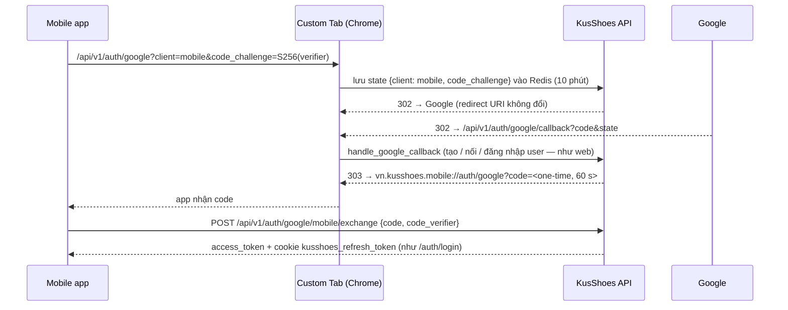

# Deploy — Đăng nhập Google cho app mobile

Nhánh: `feature/client-side-3d` (KusShoes `BE/` + ar-ai-exe `mobile/`).

## Thay đổi gì

App mobile dùng **đúng luồng Google OAuth của web** (`/auth/google` → Google → `/auth/google/callback`
→ `handle_google_callback`). Chỉ khác bước cuối: phiên mobile không nhận token qua URL mà nhận một
**mã dùng một lần** gắn với PKCE S256, rồi đổi mã đó lấy phiên.



| Thành phần | Thay đổi |
|---|---|
| `GET /api/v1/auth/google` | Thêm query `client=web|mobile` (mặc định `web`) và `code_challenge` (bắt buộc khi `mobile`, 43 ký tự base64url). |
| `GET /api/v1/auth/google/callback` | State của mobile → chuyển về `MOBILE_GOOGLE_REDIRECT_URI?code=…` hoặc `?error=<AUTH_*>`, **không** kèm token, **không** đặt cookie. State web/cũ → giữ nguyên hành vi. |
| `POST /api/v1/auth/google/mobile/exchange` | Mới. Mã dùng một lần; sai verifier cũng hủy mã; lỗi trả `401 AUTH_GOOGLE_MOBILE_CODE_INVALID`. |
| Config mới | `MOBILE_GOOGLE_REDIRECT_URI` (mặc định `vn.kusshoes.mobile://auth/google`), `MOBILE_GOOGLE_CODE_EXPIRE_SECONDS` (mặc định `60`). Có default nên **không cần sửa `.env`**. |
| DB | Không có migration. |
| Google Cloud Console | **Không cần sửa.** Redirect URI vẫn là `https://136.85.55.175.sslip.io/api/v1/auth/google/callback`. Email test vẫn phải nằm trong *OAuth consent screen → Test users*. |

Bảo mật: URI trả về app là giá trị cấu hình cố định (không nhận từ client → không thành open
redirect). Nếu app khác chiếm scheme `vn.kusshoes.mobile` thì cũng chỉ lấy được mã, không đổi được
vì thiếu `code_verifier`.

## Các bước deploy lên VM (136.85.55.175)

```bash
ssh <user>@136.85.55.175
cd <thư mục repo KusShoes trên VM>
git fetch
git checkout feature/client-side-3d
git pull

cd BE
# Chỉ build lại api; không có migration.
docker compose -f docker-compose.prod.yml -f docker-compose.vm.yml up -d --build api
docker compose -f docker-compose.prod.yml -f docker-compose.vm.yml ps api   # đợi healthy (~1–3 phút)
```

## Kiểm tra sau deploy

Chạy từ máy bất kỳ:

```bash
API=https://136.85.55.175.sslip.io

# 1. Endpoint mới đã có
curl -s $API/openapi.json | grep -o '/api/v1/auth/google/mobile/exchange'

# 2. Mobile thiếu PKCE bị từ chối → 422
curl -s -o /dev/null -w '%{http_code}\n' "$API/api/v1/auth/google?client=mobile"

# 3. Mobile có PKCE → 307/302 sang accounts.google.com
curl -s -o /dev/null -w '%{http_code} %{redirect_url}\n' \
  "$API/api/v1/auth/google?client=mobile&code_challenge=E9Melhoa2OwvFrEMTJguCHaoeK1t8URWbuGJSstw-cM"

# 4. Web không đổi → 307/302 sang accounts.google.com
curl -s -o /dev/null -w '%{http_code} %{redirect_url}\n' "$API/api/v1/auth/google"

# 5. Code giả bị từ chối → 401 AUTH_GOOGLE_MOBILE_CODE_INVALID
curl -s -X POST $API/api/v1/auth/google/mobile/exchange -H 'Content-Type: application/json' \
  -d '{"code":"xxxxxxxxxxxxxxxxxxxxxxxxxxxxxxxxxxxxxxxx","code_verifier":"dBjftJeZ4CVP-mB92K27uhbUJU1p1r_wW1gFWFOEjXk"}'
```

Rồi trên điện thoại (APK build từ ar-ai-exe `feature/client-side-3d`, xem
`ar-ai-exe/docs/windows-kusstudio-runbook.md` Bước 4):

1. Mở app → **Tiếp tục với Google / Gmail** → Chrome Custom Tab mở màn chọn tài khoản Google.
2. Chọn tài khoản (phải nằm trong Test users) → tab tự đóng → app vào màn chính đã đăng nhập.
3. Đóng hẳn app, mở lại → vẫn đăng nhập (refresh cookie hoạt động).
4. Web `kusshoes.vercel.app` → đăng nhập Google vẫn chạy như cũ.

## Khi lỗi

| Hiện tượng | Nguyên nhân thường gặp |
|---|---|
| Tab Google mở rồi dừng ở trang web KusShoes thay vì quay về app | Server chưa deploy bản này (bỏ qua `client=mobile`). |
| App báo "Phiên đăng nhập Google đã hết hạn" | Để tab mở quá 10 phút (state hết hạn) — thử lại. |
| Google báo `access_denied` / "app chưa được xác minh" | Email chưa có trong Test users của OAuth consent screen. |
| `AUTH_GOOGLE_MOBILE_CODE_INVALID` | Mã quá 60 s hoặc đã dùng; thử lại. Nếu lặp lại: kiểm tra Redis của VM. |

## Rollback

Deploy lại commit trước đó của `BE/` (`git checkout <commit cũ>` rồi chạy lại lệnh `up -d --build api`).
Luồng web không phụ thuộc thay đổi này nên rollback không ảnh hưởng đăng nhập web.
